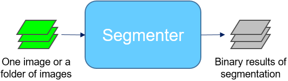

# Building Block 1: **Segmenter**


The **Segmenter** is the core building block acutally doing the computation for getting segmentation by either a classic image segmentation workflow or a model trained by an iterative DL workflow. We refer [this documentation](https://github.com/AllenInstitute/aics-segmentation/blob/master/docs/jupyter_lookup_table.md) for quick development of a classic image segmentation workflow for a specific type of image, and [Curator tutorail](./bb2.md) + [trainer tutorial](./bb3.md) for how to train a deep learning based segmentation model. 



## Option 1: Classic image segmentation 

Suppose you already build a classic image segmentation workflow for your data and you call this workflow, for example "FBL_HIPSC". 

### Apply on one image

Suppose we have a file at /home/data/fbl/image_test.tiff and we want to save the segmentation at /home/data/fbl_segmentation/

```bash
batch_processing --workflow_name FBL_HIPSC --struct_ch 0 --output_dir /home/data/fbl_segmentation/ per_img --input /home/data/fbl/image_test.tiff 
```

### Apply on a folder of images 

Suppose we want to segmentat all `.tiff` files in `/home/data/fbl/` and save the segmentations at `/home/data/fbl_segmentation/`

```bash
batch_processing --workflow_name FBL_HIPSC --struct_ch 0 --output_dir /home/data/fbl_segmentation/ per_dir --input_dir /home/data/fbl/ --data_type .tiff
```


## Option 2: Deep learning segmentation model

Suppose you have already trained a model saved at '/home/data/models/seg.pytorch'

### Apply on one image

Copy and paster the configuration file at `./config/predict_file.yaml` into a new one, for example `/home/config_files/predict_file_lab.yaml` and make sure to change (1) the path to the file, (2) the index of structure channel, (3) the output path in the new configuration file, (4) the path to the saved model.

```bash
dl_predict --config /home/config_files/predict_file_lab.yaml
```

### Apply on a folder of images 

Copy and paster the configuration file at `./config/predict_folder.yaml` into a new one, for example `/home/config_files/predict_folder_lab.yaml` and make sure to change (1) the path to the folder, (2) the type of files to be processed (3) the index of structure channel, (4) the output path in the new configuration file, (5) the path to the saved model.

```bash
dl_predict --config /home/config_files/predict_folder_lab.yaml
```

You can find the desciptions of all parameters in the configuration `.yaml` [here](./doc_pred_yaml).