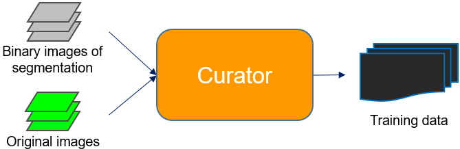

# Building Block 2: **Curator**

**Curator** is used to prepare training data for **Trainer**. It really emphasizes the iterative part of the DL workflow we presented in the [paper](https://www.biorxiv.org/content/10.1101/491035v1). Namely, after having some preliminary segmentation results, you can improve the performance by training a deep learning model with curated segmentations in an iterative fashion. 

*Annotating images is a way to imcorporate human knowledge into training the deep learning based segmentation model. But, we never want to directly draw the segmentation manually. That could very time consuming and subjective. Instead, we want to draw areas to guide the model on whether the  automatic segmentation result is realiable or which segmentation (always from automatic algorithms) to use in different areas.*



There are three scenarios that the current version of **Curator** can handle. The same "curation" idea can be adapted based on the current scripts for your special needs. 

1. Sorting: If your segmentation algorithm only works well on a subset of images that you need to analyze (maybe due to instability of the algorithm or variations between images), you should sort out the successful cases and train your model with them.
2. Merging: If the objects to be segmented in each image form two sub-populations (e.g., mitotic cells vs. interphase cells) and different algorithms are needed to segment each sub-population, you should merge the two segmentation versions and train your model with the merged ground truth. 
3. Take-All: If you already have ground truth data (e.g., by manual annotation or you are using simulated images with known ground truth), there is a simple script to convert your data into the format compatible with **Trainer**.


## Sorting:

Suppose you have a set of raw images and their segmentations, and each raw image is multi-channel with the structure channel in the third (so `--input_channel`=2, zero-base). Training data will be generated automatically at the end of sorting. A `.csv` file needs be generated to track and resumes the process when necessary and you can name it `curator_sorting_tracker.csv`. You might also want to create excluding masks (see special note 1 below) for one or more images. If so, you can specify it as `--mask_path`. Additionally, make sure to check special note 2 for input image normalization. In the following code example below, we are using "normalization recipe" 15. 

Here, we assume the files in `raw_path` and `seg_path` have the following correspondence: Suppose `raw_path` has an image `img_001.tiff`, then `seg_path` needs to have the corresponding segmentation result named as `img_001_struct_segmentation.tiff`. Users do not need to worry about naming, if the segmentation is generated by our segmenter (either classic or deep learning), as `_struct_segmentation.tiff` is the default name for segmentation results.

### How to run?

```bash
curator_sorting \
    --raw_path /path/to/raw/image/ \
    --input_channel 2 \
    --data_type .tiff \
    --seg_path /path/to/segmentation/ \
    --train_path /path/to/training_data/ \
    --csv_name /path/to/curator_sorting_tracker.csv \
    --mask_path  /path/to/excluding_mask/  \
    --Normalization 15
```

### How to use?

A side-by-side view of the original image and the segmentation will pop up after the code is finished running and you should be able to decide if the segmentation is good or bad with your mouse by a right-click or a left-click. 

* left-click = 'Bad'
* right-click = 'Good'


If an image is labeled as 'Good' (i.e., after a right-click), users will be asked if an excluding mask is needed. If yes, type in `y` in the command line or type in `n` if otherwise. If typed in `y`, a new window will pop up for drawing polygons on the image as the excluding mask.

* When adding a polygon, left-clicks will be recorded as the vertices of the polygon. After the last vertex, a right mouse click will close the polygon (connecting the last vertex to the first vertex). **Make sure you only draw within the upper left panel, i.e., the original image** 
* Multiple polygons can be added in one image
* After finished drawing with one image, press `D` to close the window and move on to the next one
* Press `Q` to quit current annotation (can resume later)


## Merging: 

Suppose you have a set of raw images which are multi-channel with the structure channel in the third (so `--input_channel`=2, zero-base). Also, suppose we have two different versions of segmentations, say `seg1` and `seg2`, each of which is more suitable for certain cells in each image. The merging masks for combining the two versions will need to be created. For each mask, you will need to draw polygons on a 2D image to indicate the areas to use `seg1` and the areas outside the polygons will use `seg2` by default. (*It is important to properly assign which version is named `seg1` and which is named `seg2`.*) All masks drawn in 2D will be duplicated on every z-slice (see Note 3 below for more details). Training data will be generated automatically at the end of merging curation. A `.csv` file needs be generated to track and resumes the process when necessary and you can name it `curator_merging_tracker.csv`. You might also want to create excluding masks (see special note 1 below) for one or more images. If so, you can specify as `--ex_mask_path`. Additionally, make sure to check special note 2 for input image normalization. In the following code example below, we are using "normalization recipe" 15. 

Here, we assume the files in `raw_path`, `seg1_path` and `seg2_path` have the following correspondence: Suppose `raw_path` has an image `img_001.tiff`, then `seg1_path` and `seg2_path` both need to have a corresponding segmentation file named as `img_001_struct_segmentation.tiff`. Users do not need to worry about naming, if the segmentation is generated by our segmenter (either classic or deep learning), as `_struct_segmentation.tiff` is the default name for segmentation results.

### How to run?

```bash
curator_sorting \
    --raw_path /path/to/raw/image/ \
    --input_channel 2 \
    --data_type .tiff \
    --seg1_path /path/to/seg1/ \
    --seg2_path /path/to/seg2/ \
    --train_path /path/to/training_data/ \
    --csv_name /path/to/curator_merging_tracker.csv \
    --mask_path  /path/to/merging_mask/ \
    --ex_mask_path  /path/to/excluding_mask/ \
    --Normalization 15
```

### How to use?

A side-by-side view of the original image and the segmentation will pop up after the code is finished running for you to select images and draw masks. If one image shouldn't be included in the training dataset, press `B` to label the image as "bad" and move on to the next one. Otherwise, you can start drawing polygons to assign regions to either workflow. **Make sure you only draw within the upper left panel, i.e., the original image. For each polygon you draw, the segmentation on the rightmost panel will be used to replace the corresponding part in the middle panel.** (Again, it is importatnt to specify which is v1 and which is v2 properly as execution parameters.)

* When adding a polygon, left-clicks will be recorded as the vertices of the polygon. After the last vertex, a right mouse click will close the polygon (connecting the last vertex to the first vertex). 
* Multiple polygons can be added in one image
* After finished drawing with one image, press `D` to close the window and move on to the next one
* Press `Q` to quit current annotation (can resume later)

After assigning the regions in the images to either workflow, users will also be asked if an excluding mask is needed. If yes, type in `y` in the command line or type in `n` if otherwise. If typed in `y`, a new window will pop up for drawing polygons on the image as the excluding mask. (same as drawing the merging mask).


## Take-All:

If you already have ground truth data (e.g., by manual annotation or you are using simulated images with known ground truth), **Curator** can take all of them and convert them to a specific format compatible **Trainer** (e.g., naming convention and input normalization). Follow the steps below if you wish to do so. 

1. Make sure all original images are in one folder and have the same format (e.g., multi-channel `ome.tif` with the target structure in channel `0`). 
2. Make sure all segmentations (i.e. ground truth images) are in a different folder and each filename starts with the base name of the corresponding original image (without extension) and ends with `_struct_segmentation.tiff`. For example, the segmentation image for original image `img_001.tiff` should have the filename `img_001_struct_segmentation.tiff`.
3. (optional) If excluding masks are needed for certain images, make sure that they are saved in another folder (different from original and segmentation) and each filename starts with the base name of the corresponding original image (without extension) and ends with `_mask.tiff`. For example, the excluding mask image for original image `img_001.tiff` should have the filename `img_001_mask.tiff`. The areas to be excluding should have value `0` in the image, while other areas have positive values. 

You can use the following code example to use this version of **Curator**.

```bash
curator_takeall \
    --raw_path /path/to/raw/image/ \
    --data_type .tiff \
    --input_channel 2 \
    --seg_path /path/to/segmentation/ \
    --train_path /path/to/training_data/ \
    --mask_path /path/to/excluding_mask/ \
    --Normalization 15 
```

=======================

### Special note 1: Masking areas to be excluded

It is not uncommon to have a small area in an image that should be excluded from training due to bad segmentation. In the context of sorting, for example, an image can be almost perfectly segmented except for a small area. You may not want to simply say the segmentation for this image failed, but instead, to include excluding masking areas to only ignore the small area that failed. This step is certainly optional and only meant to include more images for training. For sorting/merging, an optional step can be triggered to draw a mask (polygons) on a 2D image (max z-projection) to indicate the areas to be excluded. For take-all, an optional folder can be used to save all mask images.


### Special note 2: "--Normalization"

It is important to normalize your images before feeding them into the deep learning model. For example, if your model is trained on images with intensity values between 300 and 400 with mean intensity 310, it can have a hard time when being applied to a new image with intensity values between 360 and 480 with mean intensity 400, even if the actual contents look very similar. We provide users with a set of pre-defined 'recipes' for image normalization and all of them are based on three basic functions: min-max, auto contrast and background subtraction. More details about the min-max and auto contrast functions can be found [here](). `suggest_normalization` in the `aicssegmentation` package can help to determine the proper parameter values for your data. Background subtraction is implemented as subtracting the gaussian smoothed image from the original image and rescale to [0, 1]. This function can be used to correct uneven intensity levels and the only parameter is the gaussian kernel size. As a rule of thumb, one can use half the size of average uneven areas. An optional parameter is to set an upper bound for intensity so that any values above the upper bound will be considered outliers and re-assign to the min intensity of the image. In case you need to add your own recipes, you can modify the function `input_normalization` in `utils.py` (e.g., copy and paste one of the current recipes, change the parameters, and give it a new recipe index).

List of current pre-defined recipes:

* 0: min-max
* 1: auto contrast [mean - 2 * std, mean + 11 * std]
* 2: auto contrast [mean - 2.5 * std, mean + 10 * std]
* 7: auto contrast [mean - 1 * std, mean + 6 * std]
* 10: auto contrast [min, mean + 25 * std] with upper bound intensity 4000
* 12: background subtraction (kernel=50) + auto contrast [mean - 2.5 * std, mean + 10 * std]
* 15: background subtraction (kernel=50) with upper bound intensity 4000

### Special note 3: Interface design

#### Techincal consideration

Currently, the interface of merging/sorting is implemented only using `matplotlib` without any advanced packages for interface building. Our goal is to keep it simple and easy to setup. It should be robust across different machines and easy to be hacked so that users can customize their own curation interface when necessary. We are also investigating other ways for implementing the interphase that is both more user friendly, easy to setup and robust across different machines. 

#### Human computer interaction consideration

The best way for annotation may vary from problem to problem. Such variation could be in two aspects:

(1) how to visualize current results for determining where to annotate

In the current implementation, the max-projection along z and the middel z slice is presented in *merging*, while extra slices above and below middle slice are also shown in *sorting*. It is very likely that different ways (e.g., show the top few z slices or not showing max-projection) may be more suitable in specific problems. This should be easily hackable by modifying `PATH/TO/aicsmlsegment/bin/curator/curator_sorting.py` or `PATH/TO/aicsmlsegment/bin/curator/curator_merging.py`. Looking for code sections above `plt.figure()`.

(2) how to annotate

In the current implementation, all mask drawing is done as polygons in 2D and duplicated on every z slice as 3D mask. The motivation is drawing in 3D is hard and time-consuming, no matter slice by slice or directly in 3D visualization. A very common question for *merging* is that **What if two cells overlape and one cell needs segmentation version 1 and the other cell needs segmentation version 2?**  First of all, we assume this is not true for all cases require merging. In other words, we expect there are always at least some non-overlapping parts on the z-projection. Otherwise, we may visualize the images in a different way (e.g., viewing along x or y axis). Then, the overlapping areas between the two cells can be marked as 'exclusing mask' to be ignored during training. Our goal is to make the drawing as simple as possible so that it is very easy and fast to get annotation on more images without worrying about throwing away some parts in certain images.
