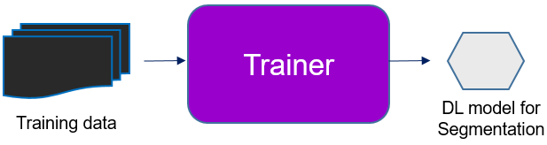

# Building Block 3: **Trainer**

**Trainer** is used to train deep learning-based segmentation models. The input for **Trainer** should be data prepared by **Curator** (see [documentation](./bb2.md)) and the output should be a model that can be used in **Segmenter**.



Copy and paste the configuration file at './config/train.yaml' to create a new one, for example, '/home/config_files/train_lab.yaml'. Check the parameters and make changes if needed. You should only need to (1) choose model type from the two options, (2) insert the file path for input data, (3) insert the output file path for the model. A detailed explanation of all parameters can be found [here](./doc_train_yaml.md). 

```bash
dl_train --config /home/config_files/train_lab.yaml
```

### When multiple GPUs are available

By default, **Trainer** will use the first available GPU for computation. If there are multiple GPUs on your machine, you can choose which GPU to use by setting `CUDA_VISIBLE_DEVICES` before running **Trainer**.

```bash
CUDA_VISIBLE_DEVICES=2  dl_train --config /home/config_files/train_lab.yaml
```
