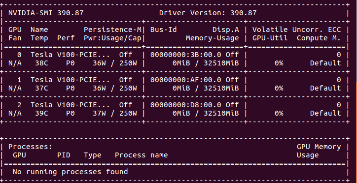
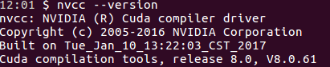

# How to setup CUDA and check the right CUDA version?

What is [CUDA](https://developer.nvidia.com/cuda-toolkit)? It is a package for utilizing NVDIA GPU for high performance computing.  

First of all, you need an NVIDIA GPU card properly installed on your Linux machine or computing cluster. Here we assume the GPU card has been physically in place and the hardware driver has been installed. 

1. check your GPU driver version

Running command  `nvidia-smi` in your terminal will give an overview of your GPU cards, for example

So, we have Driver Version: 390.87

2. install CUDA

Running command `nvcc --version` in your terminal will give an overview of your CUDA installation.

You cannot see this message if CUDA is not setup on your machine. If so, you need to install CUDA. In order to determine which CUDA version fits your GPU, check this [chart](https://stackoverflow.com/questions/30820513/what-is-the-correct-version-of-cuda-for-my-nvidia-driver/30820690#30820690). For our case (Driver Version = 390.87), CUDA 9.0 or higher is good for us. 

Go to [CUDA website](https://developer.nvidia.com/cuda-toolkit) and follow the download and installation instruction to install CUDA.

