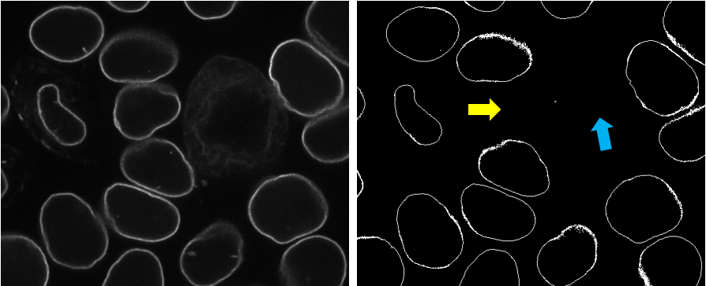

# Demo 2: Segmentation of Lamin B1 in 3D fluorescent microscopy images of hiPS cells 

In this demo, we will demonstrate how to get the segmentation of Lamin B1 in 3D fluorescent microscopy images of hiPS cells. Before starting this demo, make sure to check out [demo 1: build a classic image segmentation workflow](./demo_1.md), and detailed descriptions of the building blocks in our segmenter ([Binarizer](./bb1.md), [Curator](./bb2.md), [Trainer](./bb3.md)). The data used in this demo can be found on [allencell quilt bucket](https://open.quiltdata.com/b/allencell/packages/aics/laminb1_sample_data)/


## Stage 1: Run **Binarizer** (classic image segmentation workflow) and Assess Results

Suppose you already worked out a classic image segmentation workflow and saved it as `seg_lmnb1_interphase.py` (i.e., setting `workflow_name` as `lmnb1_interphase`). You can run 

```bash
batch_processing \
    --workflow_name lmnb1_interphase \
    --struct_ch 0 \
    --output_dir /path/to/segmentation \
    per_dir \
    --input_dir  /path/to/raw \
    --data_type .tiff
```
to batch process all Lamin B1 images in a folder and evaluate them.

During evaluation, some results appear to be good but some have errors (left: original; right: binary image from **Binarizer**). 



Some objects were missed in the segmentation due to the failure of an automatic seeding step (see yellow arrow). Also, this workflow performed poorly on mitotic cells (see blue arrow). The segmentation wasn't able to produce consistent result on all images, however, we can to leverage the successful ones to build a DL model.

## Stage 2: Run **Curator** (sorting)

The goal of this curation step is to select those images that were successfully segmented so it is appropriate to use the "sorting" strategy in **Curator** . It can be achieved by running the code below.

```bash
curator_sorting \
    --raw_path /path/to/raw \
    --data_type .tiff \
    --input_ch 0 \
    --seg_path /path/to/segmentation \
    --mask_path /path/to/curator_sorting_excluding_mask \
    --csv_name /path/to/sorting_record.csv \
    --train_path /path/to/training_data \
    --Normalization 10
```

## Stage 3: Run **Trainer** 

Find/build the `.yaml` file for training (e.g, './config/train.yaml') and make sure to following the list [**here**](./doc_train_yaml.md) to change the parameters, such as the training data path, the path for saving the model, etc..

```bash
dl_train --config /path/totrain_config.yaml
```
to start training of the model. 

Depending on the size of your training data, the training process can take 8~32 hours

## Stage 4: Run **Binarizer**

After the training is finished, you can either apply the model on one image or a folder of image. Simply find the `.yaml` file for processing a folder of images (e.g., `./config/predict_folder.yaml`) or the `.yaml` file for processing a single image (e.g., `./config/predict_file.yaml`). Make sure to follow the list [**here**](./doc_pred_yaml.md) to change the parameters, such as the image path, the output path, the model path, etc.. Then you can run

```bash
dl_predict --config /path/to/predict_file_config.yaml
```
to apply the model on your data.

Looking at the results, you can probably notice that Lamin B1 in all interphase cells were segmented well, but the model still failed to correctly segment the structure in mitotic cells. To improve the model accuracy, you can develop another classic image segmentation workflow specifically for Lamin B1 in mitotic cells and call it `lmnb1_mitotic`.

In this demo, to be more efficient, we will use a mitotic dataset, where each image has at least one mitotic cell. Suppose all the images are saved in folder `raw_mitosis`. 

Then run the **Binarizer** twices:
* first run with the deep learning model (better for interphase) and save the segmentation in folder `seg_v1`. (Again, make sure to follow the list [**here**](./doc_pred_yaml.md) to change the parameters)

```bash
dl_predict --config /path/to/predict_folder_config.yaml
```

* second run with the `lmnb1_mitotic` workflow (better for mitosis), and save the segmentation in folder `seg_v2`.

```bash
batch_processing \
    --workflow_name lmnb1_mitotic \
    --struct_ch 0 \
    --output_dir /path/to/seg_v2 \
    per_dir \
    --input_dir /path/to/raw_mitosis \
    --data_type .tiff
```

## Stage 5: Run **Curator**

Now with the combined results from the DL model and the classic segmentation workflow, it is necessary to perform another curation step to merge the two segmentation versions (for interphase and mitosis) of each image. Therefore the "merging" strategy in **Curator** will be used by running the code below. The newly generated training data can be saved in the same folder as the previous training step in order to keep using them for training. 

```bash
curator_merging \
    --raw_path /path/to/raw_mitosis/  \
    --input_ch 0  \
    --data_type .tiff \
    --seg1_path /path/to/seg_v1 \
    --seg2_path /path/to/seg_v2 \
    --mask_path /path/to/curator_merging_mask   \
    --ex_mask_path /path/to/curator_merging_excluding_mask \
    --csv_name /path/to/merging_record.csv  \
    --train_path /path/to/training_data \
    --Normalization 10
```

## Stage 6: Run **Trainer**

Find/build the `.yaml` file for training (e.g, './config/train.yaml') and make sure to following the list [**here**](./doc_train_yaml.md) to change the parameters, such as the training data path, the path for saving the model, etc..

```bash
dl_train --config /path/to/train_config.yaml
```
to start training of the model. 

## Stage 7: Run *Binarizer*

After training is finished, find the `.yaml` file for processing a folder of images (e.g., `./config/predict_folder.yaml`) and make sure to follow the list [**here**](./doc_pred_yaml.md) to change the parameters. Then you can run

```bash
dl_predict --config /path/to/predict_folder_config.yaml
```
to apply the model on your data.

In our case, Lamin B1 in both interphase cells and mitotic cells were correctly segmented after the second round of training the DL model. 


