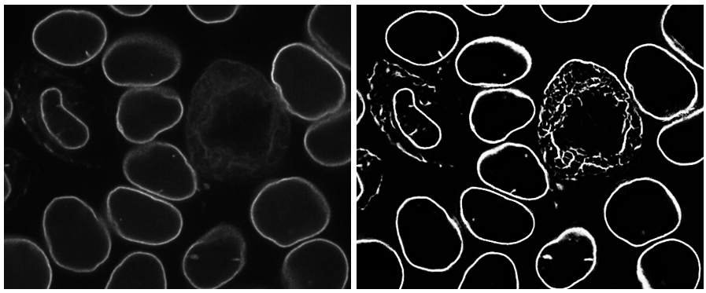

# Demo 2: Segmentation of Lamin B1 in 3D fluorescent microscopy images of hiPS cells 

In this demo, we will demonstrate how to get the segmentation of Lamin B1 in 3D fluorescent microscopy images of hiPS cells. Before starting this demo, make sure to check out [demo 1: build a classic image segmentation workflow](./demo_1.md), and detailed descriptions of the building blocks in our segmenter ([Binarizer](./bb1.md), [Curator](./bb2.md), [Trainer](./bb3.md)).

## Stage 1: Run **Binarizer** (classic image segmentation workflow) and Assess Results

Suppose you already worked out a classic image segmentation workflow and saved it as `seg_lmnb1_interphase.py` (i.e., `workflow_name=lmnb1_interphase`). You can run 

```bash
batch_processing --workflow_name lmnb1_interphase --struct_ch 0 --output_dir /allen/aics/assay-dev/Segmentation/DeepLearning/for_april_2019_release/LMNB1_classic_workflow_segmentation_iter_1 per_dir --input_dir  /allen/aics/assay-dev/Segmentation/DeepLearning/for_april_2019_release/LMNB1_fluorescent --data_type .tiff
```
to batch process all Lamin B1 images in a folder and evaluate them.

During evaluation, some results appear to be good but some have errors (left: original; right: binary image from **Binarizer**). 


Some objects were missed in the segmentation due to the failure of an automatic seeding step (see yellow arrow). Also, this workflow performed poorly on mitotic cells (see blue arrow). The segmentation wasn't able to produce consistent result on all images, however, we can to leverage the successful ones to build a DL model.

## Stage 2: Run **Curator** (sorting)

The goal of this curation step is to select those images that were successfully segmented so it is appropriate to use the "sorting" strategy in **Curator** . It can be achieved by running the code below.

```bash
curator_sorting \
    --raw_path /allen/aics/assay-dev/Segmentation/DeepLearning/for_april_2019_release/LMNB1_fluorescent \
    --data_type .tiff \
    --input_ch 0 \
    --seg_path /allen/aics/assay-dev/Segmentation/DeepLearning/for_april_2019_release/LMNB1_classic_workflow_segmentation_iter_1 \
    --mask_path /allen/aics/assay-dev/Segmentation/DeepLearning/for_april_2019_release/LMNB1_mask_iter_1 \
    --csv_name /allen/aics/assay-dev/Segmentation/DeepLearning/for_april_2019_release/sorting_test.csv \
    --train_path /allen/aics/assay-dev/Segmentation/DeepLearning/for_april_2019_release/LMNB1_training_data_iter_1 \
    --Normalization 10
```

## Stage 3: Run **Trainer** 

After clicking through all images, the training data will be automatically generated and saved at `/allen/aics/assay-dev/Segmentation/DeepLearning/for_april_2019_release/LMNB1_training_data_iter_1`. After manually updating the paths in the training configuration file in 'train.yaml', you can simply run

```bash
dl_train --config /allen/aics/assay-dev/Segmentation/DeepLearning/aics-ml-segmentation/configs/train_config.yaml
```
to start training of the model. 

Depending on the size of your training data, the training process can take 8~32 hours

## Stage 4: Run **Binarizer**

The trained is finished, the model will be saved at `/allen/aics/assay-dev/Segmentation/DeepLearning/for_april_2019_release/LMNB1_saved_model_iter_1/checkpoint_epoch_400.pytorch`. After updating the paths in the prediction configuration file `predict_folder_config.yaml`, you can run

```bash
dl_predict --config /allen/aics/assay-dev/Segmentation/DeepLearning/aics-ml-segmentation/configs/predict_folder_config.yaml
```
to apply the model on your data.

Looking at the results, you can probably notice that Lamin B1 in all interphase cells were segmented very well, but the model still failed to correctly segment the structure in mitotic cells. To improve the model accuracy, you can develop another classic image segmentation workflow specifically for Lamin B1 in mitotic cells and call it `lmnb1_mitotic`.

In this demo, to be more efficient, we will use a set of samples from mitotic enriched experiments, where there is usually at least one mitotic cell in each FOV. All the images can be found at `/allen/aics/assay-dev/Segmentation/DeepLearning/for_april_2019_release/LMNB1_fluorescent_mitosis`. 

Then run the **Binarizer** twices:
* first run with the DL model (better for interphase) and save at `/allen/aics/assay-dev/Segmentation/DeepLearning/for_april_2019_release/LMNB1_DL_iter_2`

```bash
dl_predict --config /allen/aics/assay-dev/Segmentation/DeepLearning/aics-ml-segmentation/configs/predict_folder_config.yaml
```

* second run with the `lmnb1_mitotic` workflow (better for mitosis), and save at `/allen/aics/assay-dev/Segmentation/DeepLearning/for_april_2019_release/LMNB1_classic_workflow_segmentation_iter_2`

```bash
batch_processing --workflow_name lmnb1_mitotic --struct_ch 0 --output_dir /allen/aics/assay-dev/Segmentation/DeepLearning/for_april_2019_release/LMNB1_classic_workflow_segmentation_iter_2 per_dir --input_dir /allen/aics/assay-dev/Segmentation/DeepLearning/for_april_2019_release/LMNB1_fluorescent_mitosis --data_type .tiff
```

## Stage 5: Run **Curator**

Now with the combined results from the DL model and the classic segmentation workflow, it is necessary to perform another curation step to merge the two segmentation versions (for interphase and mitosis) of each image. Therefore the "merging" strategy in **Curator** will be used by running the code below

```bash
curator_merging \
    --raw_path /allen/aics/assay-dev/Segmentation/DeepLearning/for_april_2019_release/LMNB1_fluorescent_mitosis/  \
    --input_ch 0  \
    --seg1_path /allen/aics/assay-dev/Segmentation/DeepLearning/for_april_2019_release/LMNB1_DL_iter_2/ \
    --seg2_path /allen/aics/assay-dev/Segmentation/DeepLearning/for_april_2019_release/LMNB1_classic_workflow_segmentation_iter_2 \
    --mask_path /allen/aics/assay-dev/Segmentation/DeepLearning/for_april_2019_release/LMNB1_mask_iter_2   \
    --ex_mask_path /allen/aics/assay-dev/Segmentation/DeepLearning/for_april_2019_release/LMNB1_excluding_mask_iter_2 \
    --csv_name /allen/aics/assay-dev/Segmentation/DeepLearning/for_april_2019_release/merging_test.csv  \
    --train_path /allen/aics/assay-dev/Segmentation/DeepLearning/for_april_2019_release/LMNB1_training_data_iter_2 \
    --Normalization 10
```

## Stage 6: Run **Trainer**

After clicking through all images, the training data will be saved in `/allen/aics/assay-dev/Segmentation/DeepLearning/for_april_2019_release/LMNB1_training_data_iter_2`. After manually updating the paths in the training configuration file in 'train.yaml', you can run

```bash
dl_train --config /allen/aics/assay-dev/Segmentation/DeepLearning/aics-ml-segmentation/configs/train_config.yaml
```
to start training of the model. 

## Stage 7: Run *Binarizer*

The trained model will be saved at `/allen/aics/assay-dev/Segmentation/DeepLearning/for_april_2019_release/LMNB1_saved_model_iter_2/checkpoint_epoch_400.pytorch`. After updating the paths in the prediction configuration file `predict_folder_config.yaml`, you can run

```bash
dl_predict --config /allen/aics/assay-dev/Segmentation/DeepLearning/aics-ml-segmentation/configs/predict_folder_config.yaml
```
to apply the model on your data.

In our case, Lamin B1 in both interphase cells and mitotic cells were correctly segmented after the second round of training the DL model. 


