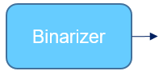
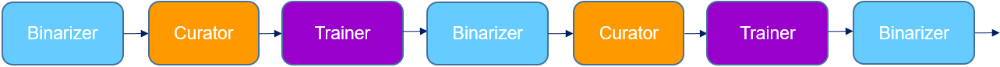

# Tutorial:

This is a tutorial on how to use the *Allen Cell Structure Segmenter* including both the classic image segmentation workflow and the iterative deep learning workflow.

The goal of the *Allen Cell Structure Segmenter* is to generate 3D segmentation of intracellular structures in fluorescence microscope images and the outputs of the segmenter are 3D binary images. Details including algorithms, validations, and examples can be found in our [bioRxiv paper](https://www.biorxiv.org/content/10.1101/491035v1). This tutorial will focus on how to run the *Allen Cell Structure Segmenter* (both classic workflows and iterative DL workflows) to get an accurate segmentation. The execution of the segmenter is based on three building blocks: **Binarizer**, **Curator** and **Trainer**. We will explain how each building block works and demonstrate with real examples.

*Note: The image reader used in our package supports images in common formats, such as `.tiff`, `.tif`, `.ome.tif`. The only vendor specific format supported by the reader is `.czi` (the file format for ZEISS microscope). For other formats, images have to be converted to `.tiff` or `.ome.tif` in advance.* 

## Understanding each building blocks:

* **Binarizer**: [documentation](./bb1.md)
* **Curator**: [documentation](./bb2.md)
* **Trainer**: [documentation](./bb3.md)

## Challenges in deep learning-based segmentation

Deep learning (DL) is a very powerful approach for 3D image segmentation. But it is as simple as collecting a set of segmentation ground truth, feeding them into a DL model and getting a perfect segmentation model. DL for 3D image segmentation is still being investigated in the field of computer vision (see top conferences organized by [MICCAI](http://www.miccai.org/) and [CVF](https://www.thecvf.com/) ). It is possible to have a model trained with our package still fails to produce accurate result. This could be due to many reasons and finding out ways to improve the model is beyond the scope of this tutorial. Here, we want to focus on demonstrating how to use our package, which is designed to (1) get a good segmentation model that could work on images existing wide variability (2) be flexible enough for advanced users to develop their own research on DL-based 3D segmentation.

## Demos on real examples:

The above flowchart is a simplified version of the segmenter showing the most important parts of the workflows. **Binarizer** refers to the classic image segmentation and **Curator** and **Trainer** makes up the DL workflows [bioRxiv paper](https://www.biorxiv.org/content/10.1101/491035v1). **Curator** and **Trainer** are used to improve the segmentation from **Binarizer** when necessary. Here, we will have demonstrations on two examples: first one only using **Binarizer** to solve the problem and the other example requiring **Curator** and **Trainer** .

### Example 1: **Binarizer** 
### Segmentation of ATP2A2 in 3D fluorescent microscopy images of hiPS cells 

[Link to the demo documentation](./demo_1.md)

Link to the demo video

### Example 2: **Curator** and  **Trainer** 
### Segmentation of Lamin B1 in 3D fluorescent microscopy images of hiPS cells 

[Link to the demo documentation](./demo_2.md)

Link to the demo video

