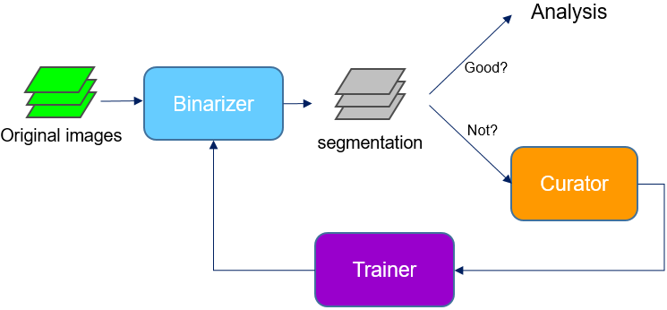

# Allen Cell Structure Segmenter Tutorials:

The Allen Cell Structure Segmenter is an open source toolkit developed at the Allen Institute for Cell Science for 3D segmentation of intracellular structures in fluorescence microscope images, which brings together classic image segmentation and iterative deep learning workflows. Details including algorithms, validations, and examples can be found in our [bioRxiv paper](https://www.biorxiv.org/content/10.1101/491035v1) or [allencell.org/segmenter](allencell.org/segmenter). This tutorial will focus on how to run the *Allen Cell Structure Segmenter* (both classic image segmentation workflow and iterative DL workflow) to get an accurate segmentation. 

The Allen Cell Structure Segmenter is implemented as two packages: [`aicssegmentation`](https://pypi.org/project/aicssegmentation/) (classic image segmentation) and [`aicsmlsegment`](https://pypi.org/project/aicsmlsegment/) (deep learning segmentation). The execution is based on three building blocks: **Binarizer**, **Curator** and **Trainer**. We will explain how each building block works and demonstrate with real examples.

*Note: The image reader used in our package supports images in common formats, such as `.tiff`, `.tif`, `.ome.tif`. The only vendor specific format supported by the reader is `.czi` (the file format for ZEISS microscope). For other formats, images have to be converted to `.tiff` or `.ome.tif` in advance.* 

## Installation:

* `aicssegmentation` (classic image segmentation): [Installation instruction](https://github.com/AllenCell/aics-segmentation) (available on Linux, MacOS, Windows)
* `aicsmlsegment` (deep learning segmentation): [Installation instruction](../README.md) (requires NVIDIA GPU and Linux OS, Windows is also okay)

## Understanding each building block:

* **Binarizer**: [documentation](./bb1.md)
* **Curator**: [documentation](./bb2.md)
* **Trainer**: [documentation](./bb3.md)

## Challenges in deep learning-based segmentation

Deep learning (DL) is a very powerful approach for 3D image segmentation. But it is not as simple as collecting a set of segmentation ground truth, feeding them into a DL model and getting a perfect segmentation model. DL for 3D image segmentation is still being investigated in the field of computer vision (see top conferences organized by [MICCAI](http://www.miccai.org/) and [CVF](https://www.thecvf.com/) ). It is possible to have a model trained with our package still failing to produce accurate result. This could be due to many reasons and finding out ways to improve the model is beyond the scope of this tutorial. Here, we want to focus on demonstrating how to use our package, the DL part of which is designed to (1) get a good segmentation model that could work on images existing wide variability (2) be flexible enough for advanced users to develop their own research on DL-based 3D segmentation.

## Demos on real examples:

The above flowchart is a simplified version of the segmenter showing the most important parts of the workflows. **Binarizer** can be either class segmentation algorithms or a DL model to compute the binary segmentation. **Curator** and **Trainer** are used to improve the segmentation from **Binarizer** when necessary. More details can be found in [bioRxiv paper](https://www.biorxiv.org/content/10.1101/491035v1)). Here, we will have demonstrations on two examples: first one only using **Binarizer** to solve the problem (i.e., a classic image segmentation workflow) and the other example also requiring **Curator** and **Trainer** (makes up the iterative DL workflow).

### Example 1: Segmentation of ATP2A2 in 3D fluorescent microscopy images of hiPS cells 

[Link to the demo documentation](./demo_1.md)

[Link to the demo video](https://youtu.be/Ynl_Yt9N8p4)

### Example 2: Segmentation of Lamin B1 in 3D fluorescent microscopy images of hiPS cells 

[Link to the demo documentation](./demo_2.md)

[Link to demo data](https://open.quiltdata.com/b/allencell/packages/aics/laminb1_sample_data)

[Link to the demo video](https://youtu.be/5jBSp38ezG8)

